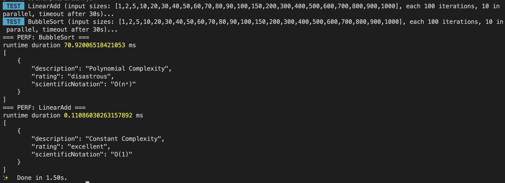

<h1 align="center">@jsheaven/perf</h1>

> Estimates the average runtime and time-complexity (big O notation) of (a)sync algorithms

<h2 align="center">User Stories</h2>

1. As a developer, I want to know the performance characteristics/complexity and thus the scalability of algorithms

<h2 align="center">Features</h2>

- ✅ Measures the runtime (duration) an algorithm (sync or async) takes
- ✅ Estimates the time complexity of an algorithm (sync or async) in big O notation
- ✅ Parallel execution using async generators
- ✅ Streaming implementation, chunked
- ✅ Available as a simple API
- ✅ Just `1403 byte` nano sized (ESM, gizpped)
- ✅ Tree-shakable and side-effect free
- ✅ Runs on Windows, Mac, Linux, CI tested
- ✅ First class TypeScript support
- ✅ 100% Unit Test coverage

<h2 align="center">Example usage (API)</h2>

<h3 align="center">Setup</h3>

- yarn: `yarn add @jsheaven/perf`
- npm: `npm install @jsheaven/perf`
- bun: `bun add @jsheaven/perf`

<h3 align="center">ESM</h3>

```ts
import { perf } from '@jsheaven/perf'

// call your algorithm from within the candidate fn() object
// the size is the input size - a number to use for scaling

// O(1): Constant complexity.
const incrementByOne = {
  name: 'LinearAdd',
  fn: async (size, callIndex) => {
    function incrementByOne(num) {
      return num + 1
    }
    incrementByOne(size)
  },
}

// O(n^x): Polynomial complexity
const bubbleSort = {
  name: 'BubbleSort',
  fn: async (size, callIndex) => {
    const arr = Array.from({ length: size }).map(() => Math.random())
    for (let i = 0; i < arr.length; i++) {
      for (let j = 0; j < arr.length - 1; j++) {
        if (arr[j] > arr[j + 1]) {
          const tmp = arr[j]
          arr[j] = arr[j + 1]
          arr[j + 1] = tmp
        }
      }
    }
  },
}

// pass one or more algorithms
const measurement = await perf([incrementByOne, bubbleSort])

console.log('=== PERF: BubbleSort ===')
console.log('runtime duration', measurement['BubbleSort'].duration, 'ms')
console.log(JSON.stringify(measurement['BubbleSort'].estimatedDomains, null, 4))

console.log('=== PERF: LinearAdd ===')
console.log('runtime duration', measurement['LinearAdd'].duration, 'ms')
console.log(JSON.stringify(measurement['LinearAdd'].estimatedDomains, null, 4))
```



<h3 align="center">CommonJS</h3>

```ts
const { perf } = require('@jsheaven/perf')

// same API like ESM variant
```

<h2 align="center">Time complexity estimation</h2>

Big O notation is a metric used in computer science to classify an algorithm based on its time and space complexity. It’s written as O(x) and is based on how the algorithm would scale with an increase or decrease in the amount of input data.

The time and space here is not based on the actual number of operations performed or the amount of memory used per se, but rather how the algorithm would scale with an increase or decrease in the amount of input data.

The notation represents how an algorithm will run in a worst-case scenario, in other words what the maximum time or space an algorithm could use is. The complexity is written as O(x), where x is the growth rate of the algorithm in regards to n, which is the amount of data input. Throughout the rest of this post, input will be referred to as n.


<h3 align="center">Types of Big O Notations</h3>

There are seven common types of big O notations. These include:

1. O(1): Constant complexity.
2. O(logn): Logarithmic complexity.
3. O(n): Linear complexity.
4. O(nlogn): Loglinear complexity.
5. O(n^x): Polynomial complexity.
6. O(X^n): Exponential time.
7. O(n!): Factorial complexity.

<h4 align="center">O(1): Constant Complexity</h4>

O(1) is known as constant complexity. This implies that the amount of time or memory does not scale with n. For time complexity, this means that n is not iterated on or recursed. Generally, a value will be selected and returned, or a value will be operated on and returned.

> operations are linear

```ts
const factorizeList = (n: number, list: Array<number>) => list[n] * 2
```

For space, no data structures can be created that are multiples of the size of n. Variables can be declared, but the number must not change with n.

<h4 align="center">O(logn): Logarithmic Complexity</h4>

O(logn) is known as logarithmic complexity. The logarithm in O(logn) has a base of two. The best way to wrap your head around this is to remember the concept of halving. Every time n increases by an amount k, the time or space increases by k/2. There are several common algorithms that are O(logn) a vast majority of the time, including: binary search, searching for a term in a binary search tree and adding items to a heap.

```ts
const needle = Math.random()
const haystack = Array.from({ length: size }, () => Math.random())
haystack.push(needle)

function binarySearch(array: number[], target: number): number {
  let low = 0
  let high = array.length - 1

  while (low <= high) {
    const mid = Math.floor((low + high) / 2)

    if (array[mid] === target) {
      return mid
    } else if (array[mid] < target) {
      low = mid + 1
    } else {
      high = mid - 1
    }
  }

  return -1
}
binarySearch(haystack, needle)
```

O(logn) space complexity commonly happens during recursive algorithms. When a recursive call is made, all current variables get placed on the stack and new ones are created. If the number of recursive calls increases logarithmically, i.e., n is halved with every recursive call, then the space complexity will be O(logn). Space complexities of O(logn) are rarer to encounter.

<h4 align="center">O(n): Linear Complexity</h4>

O(n), or linear complexity, is perhaps the most straightforward complexity to understand. O(n) means that the time/space scales 1:1 with changes to the size of n. If a new operation or iteration is needed every time n increases by one, then the algorithm will run in O(n) time.

```ts
const haystack = Array.from({ length: size }, () => Math.random())

function sumArray(array: number[]): number {
  let sum = 0
  for (let i = 0; i < array.length; i++) {
    sum += array[i]
  }
  return sum
}
sumArray(haystack)
```

When using data structures, if one more element is needed every time n increases by one, then the algorithm will use O(n) space.

<h4 align="center">O(nlogn): Loglinear Complexity</h4>

O(nlogn) is known as loglinear complexity. O(nlogn) implies that logn operations will occur n times. O(nlogn) time is common in recursive sorting algorithms, binary tree sorting algorithms and most other types of sorts.

```ts
const arr = Array.from({ length: size }).map(() => Math.random())

const partition = (arr: number[], low: number, high: number): number => {
  const pivot = arr[high]
  let i = low - 1

  for (let j = low; j < high; j++) {
    if (arr[j] < pivot) {
      i++
      const temp = arr[i]
      arr[i] = arr[j]
      arr[j] = temp
    }
  }

  const temp = arr[i + 1]
  arr[i + 1] = arr[high]
  arr[high] = temp

  return i + 1
}

const quickSort = (arr: number[], low: number, high: number): void => {
  if (low < high) {
    const pi = partition(arr, low, high)
    quickSort(arr, low, pi - 1)
    quickSort(arr, pi + 1, high)
  }
}

quickSort(arr, 0, arr.length - 1)
```

Space complexities of O(nlogn) are extremely rare to the point that you don’t need to keep an eye out for it. Any algorithm that uses O(nlogn) space will likely be awkward enough that it will be apparent.

<h4 align="center">O(nˣ): Polynomial Complexity</h4>

O(nˣ), or polynomial complexity, covers a larger range of complexities depending on the value of x. X represents the number of times all of n will be processed for every n. Polynomial complexity is where we enter the danger zone. It’s extremely inefficient, and while it is the only way to create some algorithms, polynomial complexity should be regarded as a “warning sign” that the code can be refactored. This holds true for not just polynomial complexity, but for all following complexities we will cover.

A red flag that an algorithm will run in polynomial time is the presence of nested loops. A general rule of thumb is that x will equal the number of nested loops. A major exception to this rule is when you are working with matrices and multi-dimensional arrays. Nested loops are needed to traverse these data structures and do not represent polynomial time. Polynomial time will require the number of loops to equal 2y, where y is the number of dimensions present in the data structure.

```ts
const haystack = Array.from({ length: size }, () => Math.random())

function findDuplicates(array: string[]): string[] {
  const result: string[] = []
  for (let i = 0; i < array.length; i++) {
    for (let j = i + 1; j < array.length; j++) {
      if (array[i] === array[j] && !result.includes(array[i])) {
        result.push(array[i])
      }
    }
  }
  return result
}
findDuplicates([...haystack, ...haystack])
```

For nested loops to create polynomial time complexity, all loops must be iterating over n.

Polynomial space complexity will generally be because of the creation of a matrix or multidimensional array in a function creating a table.

<h4 align="center">O(Xⁿ): Exponential Time</h4>

O(Xⁿ), known as exponential time, means that time or space will be raised to the power of n. Exponential time is extremely inefficient and should be avoided unless absolutely necessary. Often O(Xⁿ) results from having a recursive algorithm that calls X number of algorithms with n-1. Towers of Hanoi is a famous problem that has a recursive solution running in O(2ⁿ).

```ts
function fibonacci(n: number): number {
  if (n <= 1) {
    return n
  }
  return fibonacci(n - 1) + fibonacci(n - 2)
}
fibonacci(size)
```

You will probably never encounter algorithms using a space complexity of O(Xⁿ) in standard software engineering. It can be encountered when using Turing machines and the arithmetic model of computation, but this is extremely hard to implement using a JavaScript example, and beyond the scope of this project. Suffice to say, if O(Xⁿ) space complexity is ever encountered, it’s likely that something has gone horribly, horribly wrong.

<h4 align="center">O(n!): Factorial Complexity</h4>

O(n!), or factorial complexity, is the “worst” standard complexity that exists. To illustrate how fast factorial solutions will blow up in size, a standard deck of cards has 52 cards, with 52! possible orderings of cards after shuffling. This number is larger than the number of atoms on Earth. If someone were to shuffle a deck of cards every second from the beginning of the universe until the present second, they would not have encountered every possible ordering of a deck of cards. It is highly unlikely that any current deck of shuffled cards you encounter has ever existed in that order in history. To sum up: Factorial complexity is unimaginably inefficient.

```ts
const haystack = Array.from({ length: size }, () => Math.random())

function permuteArray(array: number[]): number[][] {
  if (array.length <= 1) {
    return [array]
  }

  const result: number[][] = []
  for (let i = 0; i < array.length; i++) {
    const [first] = array.splice(i, 1)
    const perms = permuteArray(array)
    for (let j = 0; j < perms.length; j++) {
      result.push([first, ...perms[j]])
    }
    array.splice(i, 0, first)
  }
  return result
}
permuteArray(haystack)
```

<h3 align="center">Accuracy of measurements and correlation</h2>

The accuracy of the algorithm for estimating the time complexity of an algorithm based on the runtime measurements obtained from a series of input sizes depends on several factors, including the quality of the data and the assumptions made by the algorithm.

The algorithm for estimating the time complexity uses a <a href="https://en.wikipedia.org/wiki/Logistic_regression" target="_blank">logarithmic regression</a> to fit a curve to the data points, where the input size is the independent variable and the runtime is the dependent variable. The slope of the curve is used to estimate the growth rate of the algorithm as the input size increases, and this growth rate is mapped to a time complexity based on a series of pre-defined ranges.

This algorithm works reasonably well for many types of algorithms, particularly those that exhibit a predictable, non-random pattern of growth as the input size increases. However, there are some types of algorithms that may not fit well with this approach, such as algorithms that exhibit a non-monotonic pattern of growth or have complex, non-linear behavior.

In general, the accuracy of the algorithm depends on the quality of the data obtained from the performance measurements, as well as the assumptions made about the nature of the growth pattern. To obtain accurate estimates of the time complexity, it is important to use a wide range of input sizes, choose input sizes that reflect the expected use case of the algorithm, and carefully consider the assumptions made about the nature of the growth pattern.

Despite these limitations, the algorithm for estimating the time complexity of an algorithm based on the runtime measurements can be a useful tool for gaining insight into the performance characteristics of an algorithm and making informed decisions about algorithm design and optimization.
